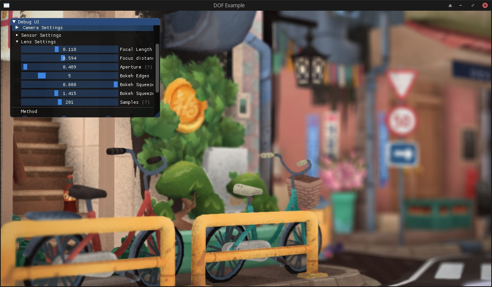
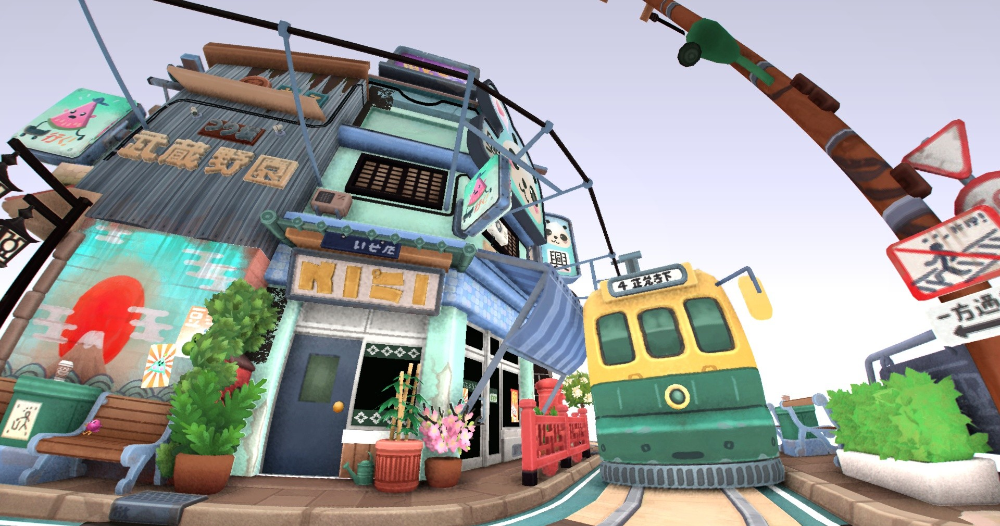

# OpenGLCameraEffects
Camera effects like chromatic aberration, vignetting, depth of field and barrel distortion.

All deps included. Simply run `cmake .`

Some code is based on the learnopengl examples.
